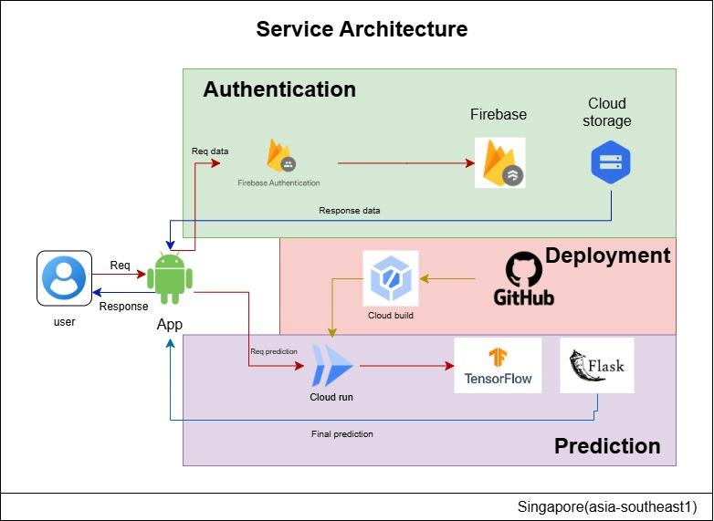

# EmotiCalm

EmotiCalm is a facial recognition-based application designed to detect stress levels and provide personalized suggestions for stress management. The project integrates cloud computing, mobile development, and machine learning to deliver a seamless experience for users.

---

## Table of Contents
1. [Project Overview](#project-overview)
2. [Architecture](#architecture)
3. [Application Design](#application-design)
4. [Machine Learning Design](#machine-learning-design)
5. [Branch Details](#branch-details)

---

## Project Overview
EmotiCalm aims to leverage advanced technology to assess stress levels from facial images and provide actionable suggestions. This project consists of three primary components:
- **Cloud Computing (API)**: Manages stress detection models and serves predictions.
- **Mobile Application**: Allows users to capture images and receive results and suggestions.
- **Machine Learning**: A TensorFlow-based model to analyze stress levels from facial features.

---

## Architecture

Below is the system architecture for the EmotiCalm project:

### Key Components:
- **Google Cloud Storage**: Stores machine learning models and user-uploaded images.
- **Cloud Run**: Hosts the API for stress prediction.
- **Firebase**: For Handle user authentication.
- **Mobile Frontend**: A user-friendly interface to interact with the system.
- **Machine Learning Model**: A TensorFlow-based neural network for facial recognition and stress detection.

---

## Application Design

The mobile application design focuses on user accessibility and clarity. The interface includes:
1. **Image Capture and Upload**: Allows users to upload facial images.
2. **Stress Analysis Display**: Shows detected stress level and corresponding suggestions.
3. **History Tab**: Keeps track of past analyses and suggestions.

### Screenshots
Below the screnshoot of our application

---

## Machine Learning Design

# README for CNN Model for Stress Level Classification

## Overview
This Convolutional Neural Network (CNN) is designed to classify images into four stress levels based on facial expressions. The model was built and trained to recognize patterns in facial emotion data and assign them to specific stress categories: **no stress**, **weak stress**, **medium stress**, and **strong stress**.

## Dataset Description
The model uses the FER-2013 dataset, a popular benchmark for facial emotion recognition. This dataset contains:
- Grayscale images of faces with a resolution of 48x48 pixels.
- Seven initial emotion categories: Angry, Disgust, Fear, Happy, Sad, Surprise, and Neutral.
- Training set: 28,709 images
- Test set: 3,589 images

For this model, the emotions are mapped to four stress levels:
- **Happy**: No stress
- **Neutral, Surprise**: Weak stress
- **Disgust, Fear**: Medium stress
- **Sad, Angry**: Strong stress

## Model Architecture
The CNN processes input images of size **(224, 224, 3)** and classifies them into four stress levels. The architecture consists of:
1. **Convolutional Layers**:
   - Four layers with increasing filters: 32, 64, 128, and 256.
   - Kernel size: (3, 3)
   - Activation: ReLU
2. **Pooling Layers**:
   - MaxPooling after each convolutional layer with pool size (2, 2).
3. **Flatten Layer**:
   - Converts 2D feature maps into 1D feature vectors.
4. **Fully Connected Layers**:
   - Two layers with 512 and 256 neurons, ReLU activation.
5. **Output Layer**:
   - Four neurons with Softmax activation for multi-class classification.

## Training Details
- **Optimizer**: Adam with a learning rate of 0.0001
- **Loss Function**: Categorical Crossentropy
- **Metrics**: Accuracy
- **Data Augmentation**: Includes rotation, shifting, zooming, and flipping to improve model generalization.

## Performance
The model aims to achieve over **70% accuracy** for classifying stress levels. Oversampling was applied to balance the dataset and improve performance on minority classes.

## Deployment
The model is suitable for deployment in real-time stress management applications. It is exported in TensorFlow.js format for use in web-based platforms and can be deployed using Google Cloud Run.

## How to Use
1. **Training**:
   - Use the provided `train.ipynb` notebook to train the model with your data.
2. **Evaluation**:
   - Evaluate the model using the test set provided in the dataset.
3. **Deployment**:
   - Convert the model to TensorFlow.js format using `tensorflowjs_converter`.
   - Deploy the model on Google Cloud Run or any compatible service.

## Future Improvements
- Integration with larger datasets for better generalization.
- Fine-tuning using transfer learning with pre-trained models.
- Optimization for mobile and edge devices for real-time stress detection.

## Author
- **Name**: Abyan Dzakky
- **Field**: Machine Learning Path

For any questions or feedback, feel free to contact me.

### Design Diagram

---

## Branch Details
To view specific implementations, refer to the following branches:
- **Cloud Computing (API)**: `branch-cc`
- **Mobile Development**: `branch-md`
- **Machine Learning**: `branch-ml`
